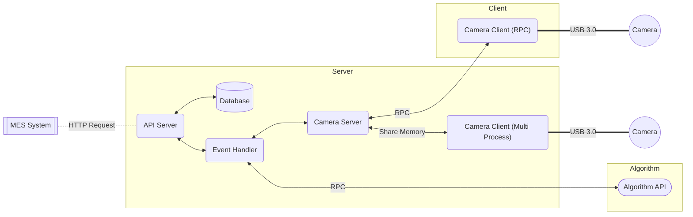

# Brick Recognition System for Qimeng Project (Phase 1)

## Architecture



## Deploy

### Requirements

* Ubuntu 20.04
* Docker
* Docker compose

### Deploy Server

To deploy service server and also camera server (`Server` part in the graph above):

```shell
docker compose up --scale worker=8    
```

### Deploy RPC Camera Client (Optional)

==TODO==

### Deploy Algorithm

==TODO==

## API

### `GET apis/ping/	`

> Server test

Response example:

```
pong
```

### `GET apis/test/`

> For debug only. Return a human-friendly list containing all detection queries.
>
> Return format:
>
> `[id]|[timestamp]|[station id]|[status]|[brick list from order]|[result]`

Response example:

```shell
234|2022-12-21 09:19:54.843322+00:00|1|FINISHED|None|{"0": "2"}
235|2022-12-21 09:27:00.648603+00:00|1|FINISHED|None|{"0": "2"}
```

### `POST apis/create/`

> Submit a detection query.
>
> Specify station ID in `x-www-form-urlencoded`
>
> ==TODO==
>
> If the query is successfully submitted, the ID for this query is returned.

Request example:

```python
# Python 3
import requests
url = "127.0.0.1:8000/apis/create/"
payload='station_id=test0'
headers = {'Content-Type': 'application/x-www-form-urlencoded'}
response = requests.request("POST", url, headers=headers, data=payload)
```

Response example:

```json
{"detection_id": 237}
```

### `GET apis/query/<id>/`

> Get detection result for certain query.
>
> In the response:
>
> - `detection_id`: The id for detection query
> - `status`: The status of detection query
>   - `SUBMMITED`
>   - `RUNNING`
>   - `FINISHED`
>   - `ERROR`
> - `result`: The result of the detection: ==TODO==

Request example:

```python
import requests
url = "127.0.0.1:8000/apis/query/237/"
payload = {}
headers = {}
response = requests.request("GET", url, headers=headers, data=payload)
```

Response example:

```json
{
    "detection_id": 237,
    "status": "SUBMITTED",
    "result": null
}
```

### `POST apis/clear/`

> Delete all detection queries on the server.

Request example:

```python
# Python 3
import requests
url = "127.0.0.1:8000/apis/clear/"
payload = {}
headers = {}
response = requests.request("POST", url, headers=headers, data=payload)
```

Response example:

```shell
success
```

